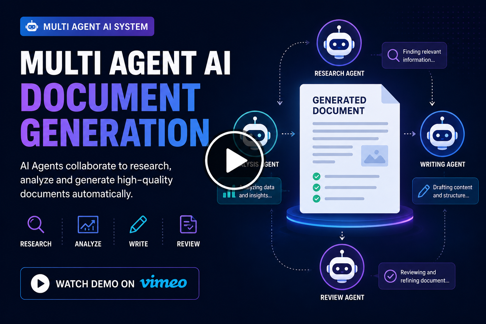
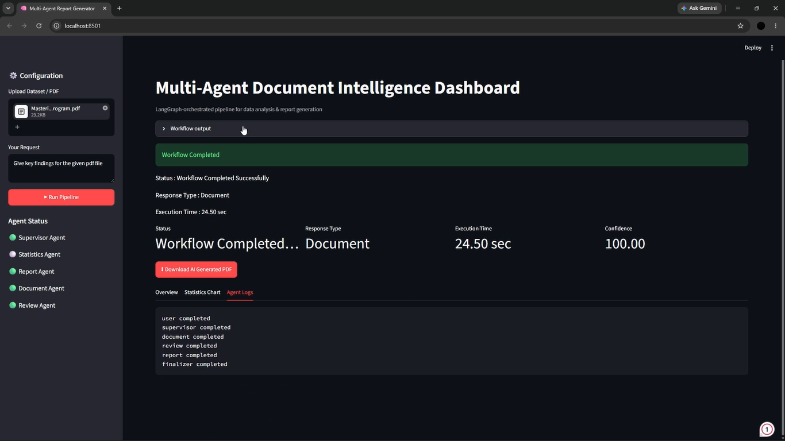
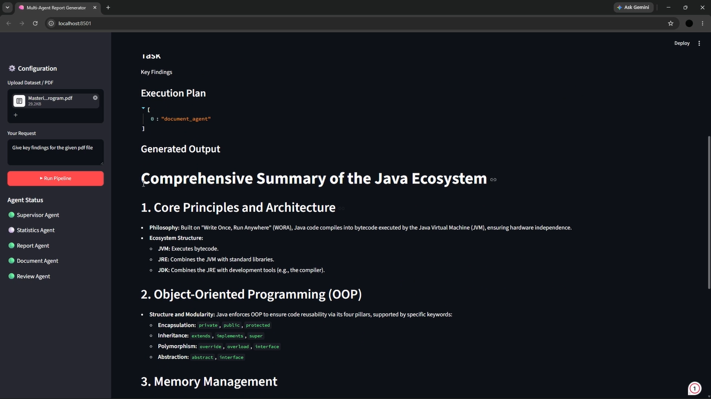
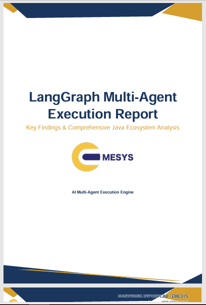
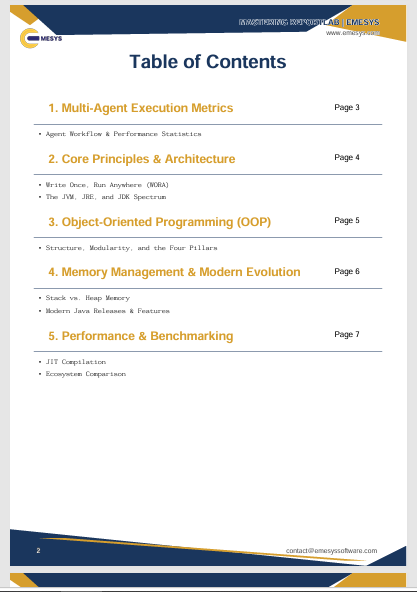
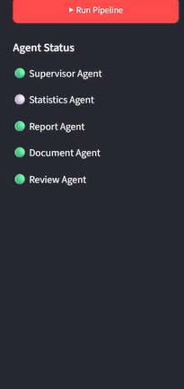

# 🤖 Multi-Agent AI Code Generation Platform

> **Intelligent Multi-Agent AI System for Automated Code Generation, Document Intelligence & Dataset Analytics**

A LangGraph-powered multi-agent AI platform that automates code generation, document analysis, and dataset analytics through a Supervisor Agent and specialized AI agents.

---

# 📑 Table of Contents

- [Project Overview](#-project-overview)
- [Problem Statement](#-problem-statement)
- [Our Solution](#-our-solution)
- [Key Features](#-key-features)
- [System Workflow](#-system-workflow)
- [Technology Stack](#-technology-stack)
- [Project Architecture](#-project-architecture)
- [Project Demo](#-project-demo)
- [Project Screenshots](#-project-screenshots)
- [Business Impact](#-business-impact)

---


# 🤖 Project Overview

The **Multi-Agent AI Code Generation Platform** is an intelligent LangGraph-powered agentic AI ecosystem designed to automate software development, document intelligence, and dataset analytics through collaborative AI agents.

Instead of relying on a single AI model, the platform uses a **Supervisor Agent** to understand user intent, coordinate specialized agents, validate outputs, and produce one unified response.

---

# 🚩 Problem Statement

Traditional AI assistants struggle with:

- Static workflows
- Single-agent limitations
- Lack of intelligent task orchestration
- Poor scalability
- Inefficient resource utilization
- Limited cross-domain support

---

# 💡 Our Solution

The platform provides:

- Supervisor Agent orchestration
- Dynamic task routing
- AI-powered code generation
- Code review & debugging
- PDF document analysis
- Dataset analytics
- Modular multi-agent architecture

---

# 🚀 Key Features

## 🧠 Supervisor Agent
- Intent understanding
- Task planning
- Dynamic routing
- Output aggregation

## 💻 Code Generation Agent
- Natural language to code
- Documentation generation

## 🛠 Code Review Agent
- Bug detection
- Optimization suggestions

## 📄 Document Analysis Agent
- PDF parsing
- Summarization

## 📊 Dataset Analysis Agent
- Data cleaning
- Statistical insights

---

# 🔄 System Workflow

```text
User
  │
  ▼
Supervisor Agent
  │
  ├── Code Agent
  ├── Document Agent
  └── Dataset Agent
        │
        ▼
 Response Aggregation
        │
        ▼
 Unified Output
```

---

# 🛠 Technology Stack

- Python
- LangGraph
- Pandas
- PyPDF2
- python-dotenv
- Pathlib
- OS
- io

---

# 🏗 Project Architecture

```text
User
 │
 ▼
Supervisor Agent
 │
 ├── Code AI
 ├── Document AI
 └── Dataset AI
 │
 ▼
Unified Response
```
---

## 🎥 Project Demo
<p align="center">
  <a href="https://vimeo.com/1211934389">
    
  </a>
</p>

<p align="center">
  ▶️ <b>Click the thumbnail to watch the full project demo on Vimeo</b>
</p>

---

# 📷 Project Screenshots

## 🧠 User Dashboard

<p align="center">
  
</p>

---

## 💻 AI Outcome

<p align="center">
  
</p>

---

## 📄 Document Generation

<p align="center">
  
</p>

---

## 📊 Documentation details

<p align="center">
  
</p>

---

## 🔀 Multi-Agent Status

<p align="center">
  
</p>

---

# 📊 Business Impact

⚡ **70% Faster** Intelligent Task Routing

💻 **50% Faster** Code Generation Turnaround

🧩 **60% Easier** System Maintainability

🎯 **80% Less** Manual Task Configuration

✅ **45% Higher** Output Consistency & Accuracy

🚀 **65% Faster** Integration of New AI Agents

🌐 **Unified** Code Generation, Document Analysis & Dataset Analytics

⚙️ **40% Better** Resource Utilization Efficiency

---


# 🌍 Vision

> *"Empowering developers and enterprises with collaborative Multi-Agent Artificial Intelligence that automates complex workflows, accelerates software development, and transforms data into actionable intelligence through intelligent orchestration."*

---

<p align="center">

**Made with ❤️ to build the next generation of Multi-Agent AI Systems.**

</p>
